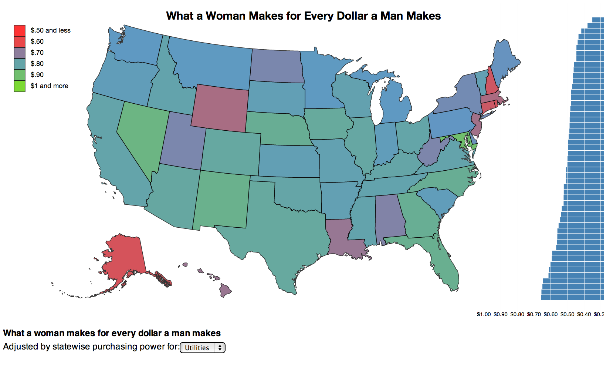
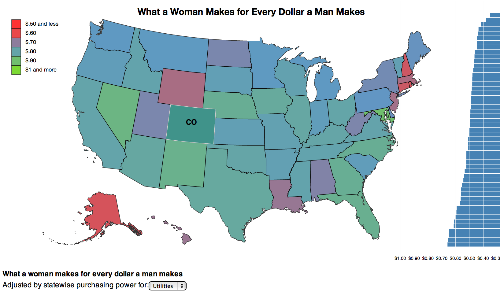
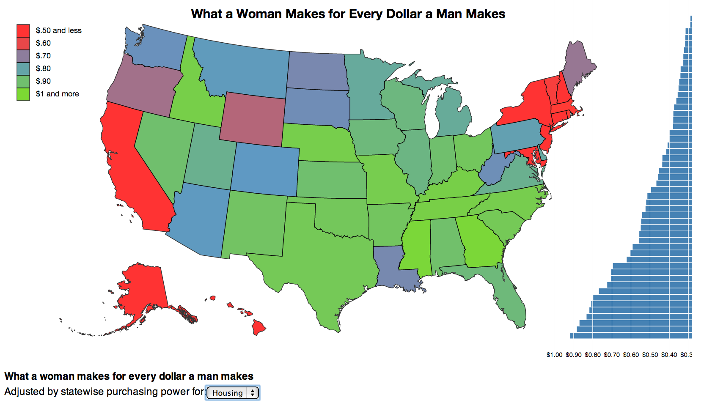
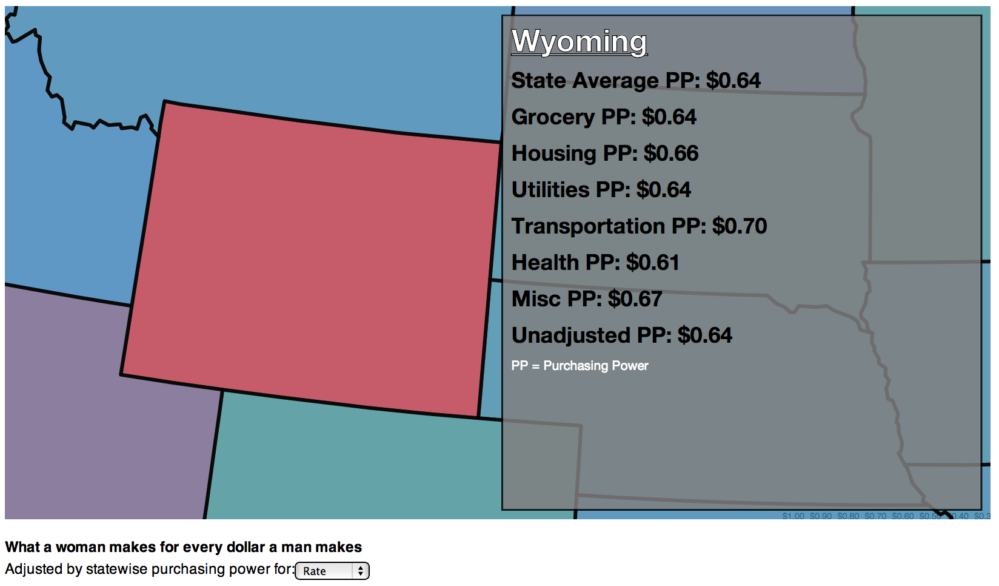

<!-- use tags blogpost1 blogpost2 blogpost3 for easy grouping -->
<!-- please reserve for @malecki's use only tags 'slides', 'emails' -->

## Blog 3

(Continued from [Blogpost 2](http://malecki.github.io/edav/2014/05/13/enkeboll-blog2/)) I wanted to show, a little clearer, the data I found at http://www.nwlc.org/sites/default/files/pdfs/nov2013_state_by_state_women_overall.pdf.  This first attempt is not much clearer, but was a good exercise in acquiring, cleaning, and joining data, and getting that data on a screen.  It currently only shows the same information as the original chart did, just with the exact numbers overlaid on top of the states themselves.






### To run
```
cd /projects/enkeboll/blog2
> python -m SimpleHTTPServer 8888
```

In your browser, visit `localhost:8888` to view the map interactively.
