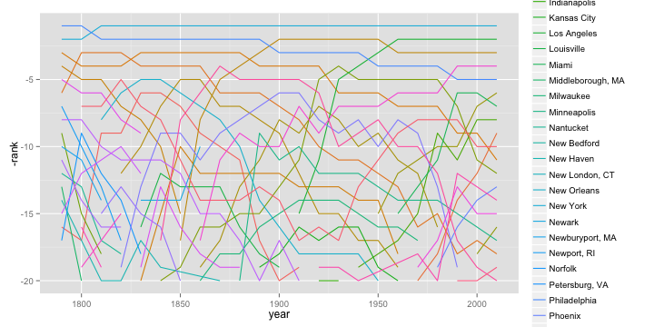
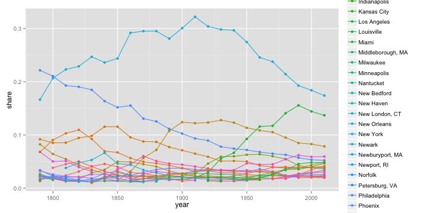
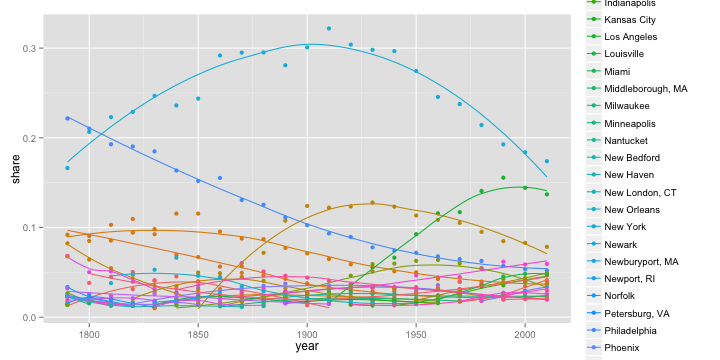
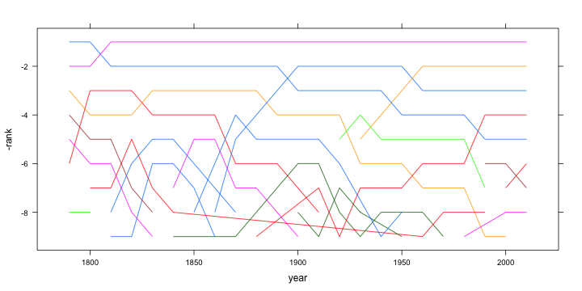
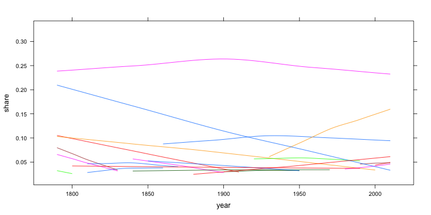

graphs with the city data
========================================================
author: malecki
date: 2014-01-28

Load the data
========================================================


```r
library(plyr)
library(ggplot2)
library(lattice)
df <- read.csv('citypop.csv')
df <- ddply(df, .(year), mutate, share=pop/sum(pop))
df <- join(df, read.csv('uspop.csv'))
```


The basics with ggplot2
========================================================


```r
ggplot(df) + aes(x=year, y=-rank, col=city) +
    geom_line()
```

 

========================================================

```r
ggplot(df) + aes(x=year, y=share, col=city) +
    geom_line(span=1) +
    geom_point()
```

 

========================================================

```r
ggplot(df) + aes(x=year, y=share, col=city) +
    geom_point() +
    geom_smooth(span=1, se=FALSE)
```

 


The basics with Lattice
========================================================


```r
xyplot(-rank~year, groups=city, data=df, subset=rank<10, type="l")
```

 

========================================================

```r
xyplot(share~year, groups=city, data=df, type="smooth", subset=rank<10, span=2)
```

 


Let's use rCharts to quickly generate and iterate some svg
================================================

```r
library(rCharts)
nv <- nPlot(share ~ year, group = "city", data = df, type = "lineChart")
nv$chart(tooltipContent= "#! function(key, x, y, e){
  return '<b>City:</b> ' + e.point.city + '<br/>' +
    '<b>Year: </b>' + e.point.year
} !#")
```

=========================
<iframe src='
graphs-figure/rcharts-output.html
' scrolling='no' seamless class='rChart 
nvd3
 '
id=iframe-
chart1ea26cad726
></iframe>
<style>iframe.rChart{ width: 100%; height: 400px;}</style>

